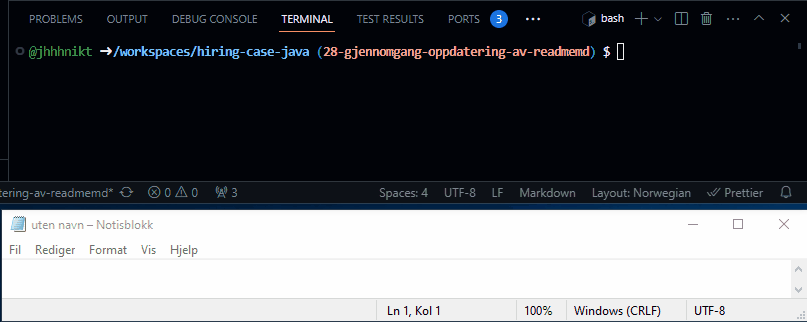
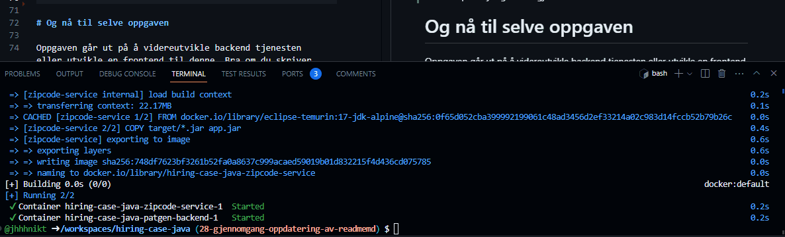

# So you think you can code?

Team for utvikling av medisinske kvalitetsregistre bruker i dag en _testpasientgenerator_ for å spare tid på opprettelsen
av nye testpasienter. Denne har blitt skrevet i en fei og behøver å jobbes videre med. Oppgaven går ut på å fullføre testpasientgeneratoren **eller** implementere en web frontend. Du velger selv om du vil løse [backend](oppgaver/backend.md) eller [frontend](oppgaver/frontend.md) -oppgaver. Det er ikke behov for å løse alt. Teamet er uansett takknemlig for den nye funksjonaliteten.

Vedlagt ligger:

 * Et påbegynt [backend](oppgaver/backend.md) prosjekt i Spring Boot web starter som finnes i `./patgen-backend/`.
 * Ressursfiler med ulike fornavn og etternavn.
 * En ekstern tjeneste i `./zipcode-service/`.
 * Et påbegynt [frontend](oppgaver/frontend.md) prosjekt, i React/Vue og TypeScript i hhv. `./patgen-app/patgen-app-react/` og `./patgen-app/patgen-app-vue/`.

Det er ett mål å opprettholde ett *tilstrekkelig nivå av tester*, selv om koden nå har en del mangler. Ny kode kan med fordel testes der annet ikke er 
anmerket.

Det er foretrukket at en oppgave løses per git commit.

Det er ikke nødvendig å løse oppgavene i en bestemt rekkefølge.

**Dersom du har åpnet `README.md` og bare ser markdown-kode, bruk tastatursnarvei *CTRL+K V* for å åpne forhåndsvisning i VSCode. [Les mer om forhåndsvisning i VSCode her](https://code.visualstudio.com/docs/languages/markdown#_markdown-preview).**

# Forberedelser

## Oppsett av utviklingsmiljø

Vedlagt zip-fil med oppgavetekst skal du ha fått med en README fil som kort beskriver de nødvendige stegene for å sette opp ett uviklingsmiljø. Denne filen kan ha et filnavn tilsvarende *hiring-case-java-yyyy-mm-dd.zip.README.md*.

# Starte tjenestene

## Codespaces (Devcontainer)

Om du har fulgt instruksjonene i *hiring-case-java-yyyy-mm-dd.zip.README.md* skal terminal-kommandoene i `.devcontainer/cli-shortcuts.sh` være tilgjengelige.

For å kjøre testene i `patgen-backen` og `zipcode-service`:

```sh
cli-run-all-tests
```

For å bygge og starte i `patgen-backen` og `zipcode-service`:

```sh
cli-docker-compose-app-refresh
```

I Codespaces gå til *PORTS* fanen for å kopiere ekstern adresse til tjenestene og endre synlighet på portene. Demonstrasjon under:



 Alternativt kan du i terminal vinduet skrive `echo $PATGENBACKEND_EXTERNAL_URL/generate-patient`. Dette vil skrive ut noe ala: *`https://verbose-space-lamp-5wx49wppvfoobarpwq-8081.app.github.dev/generate-patient`*. Åpne adressen i en ny fane i nettleseren og du vil se noe tilsvarende dette: `{"firstname":"Bjarne","lastname":"Eriksen","age":42,"fullName":"Bjarne Eriksen"}`.

For frontend har vi foreløpig ikke laget terminal-snarvei, her må du gjøre ett valg på om du skal bruke [Vue.js](https://vuejs.org/) eller [React](https://react.dev/).

### Vue.js

```sh
cd patgen-app/patgen-app-vue # Skifte mappe til Vue prosjektet.
npm install
npm run dev
```

### React

```sh
cd patgen-app/patgen-app-react # Skifte mappe til React prosjekt.
npm install
npm run dev
```

Landingsidene på Vue og React prosjektene har en diagnoseknapp for å sjekke at backend kan nås. Frontend-koden krever at port-synlighet i *PORTS* fanen endres til public for *patgen-backend* og *zipcode-service*, og at CORS innstillingene på nevnte tjenester er satt opp rett. CORS innstillinger tar vi hånd om men port-synlighet må gjøres manuelt.



# Og nå til selve oppgaven

Oppgaven går ut på å videreutvikle backend tjenesten eller utvikle en frontend til denne. Bra om du skriver unit tester/kode om ikke annet er nevnt, slik du mener det bør gjøres for produksjonskode.

Endringer/restruktureringer og fjerning av kode er tillatt, da dette er kode som ikke er tatt i bruk ennå. 
Om du ser behov for å introdusere nye avhengigheter er dette også i orden. Logg på et fornuftig nivå, der du endrer kode eller for ny kode. 

Etter hver deloppgaver skal prosjektet kunne bygge med `mvn package` kommando. I frontend vil en tilsvarende kommando være `npm run test && npm run build`. Dersom du ikke får tester til å "gå grønne", skal disse disables med kommentar eller fjernes dersom det virker mer fornuftig.

Lag én _commit_ per oppgave. Dersom du får behov for mer enn én _commit_ ber vi om at du skriver en forklarende _commit_-melding. Tenk i utgangspunktet på at oppgaven skal kunne testes på én _commit_ per oppgave (dvs sjekke ut "tidligere" _commit_). Om du foretrekker flere _commits_ per oppgave, lag da en tagg på hver fullførte oppgave.

Vi oppfordrer til at du skriver notater underveis slik at vi kan sette oss inn hva som var tenkt og eventuelle utfordringer underveis.

Dersom du ikke får til en oppgave kan du hoppe til neste og evt prøve igjen senere. Det er ikke nødvendig å løse alt. Rekkefølgen på endringer er i utgangspunktet ikke viktig.

## Opprett et notat og lag én commit pr. oppgave

Opprett notat for hver oppgave f.eks ```oppgave2.md```, ```oppgave3.md```. Her kan du blant annet skrive hvordan oppgaven er forstått, påpeke mulige forbedringer, og beskrive løsningen som er valgt.

Eksempel:

* Oppgave 1

```sh
echo "# Oppgave 1" > oppgave1.md
git add -A
git commit -m "Oppgave 1"
```
* Oppgave 2

```sh
echo "# Oppgave 2" > oppgave2.md
git add -A
git commit -m "Oppgave 2"
```

## Ja, jeg er klar til å sette i gang

Velg en av disse:

* [Backend oppgaver finner du her](oppgaver/backend.md).
* [Frontend oppgaver finner du her](oppgaver/frontend.md).

## Levering av oppgave

### Codepaces

I Codepspaces skriver du følgende kommando for å lage filer som sendes til. Pass på at siste endringer er sjekket inn i git-repositoriet.

```sh
cli-zip-assignment
```

Høyreklikk på `hiring-case-java-kandidatens-navn.zip` og `hiring-case-java-kandidatens-navn.zip.sha256sum` og velg *Download...*.

### Alternativt; manuell opprettelse av innleveringsfil

Når du er ferdig med oppgavene, lag en ny ZIP fil med din besvarelse og gi denne ett passende navn ala `hiring-case-java-kandidatens-navn.zip`. Pass på at du får med `.git` mappen. Legg ved en hash av filen slik at vi kan sjekke integriteten til filen vi mottar. I "Git Bash" eller kommandolinje på Mac/Linux kan du kjøre kommandoen `sha256sum hiring-case-java-kandidatens-navn.zip` for å generere hash.

### Innsendelse

Besvarelsen sendes i ett vedlegg i epost sammen med nevnte hash. Hvilken epost-adresse besvarelsen skal sendes til, samt tidsfrist, står beskrevet i epost fra oss.

Dersom det oppstår problemer med å sende vedlegg i epost, kan ett alternativ være å sende oss nevnte hash av fil sammen med en lenke til ZIP fil på Google Drive, OneDrive, Dropbox, eller tilsvarende.

*Coding Cowboyz 2023*
