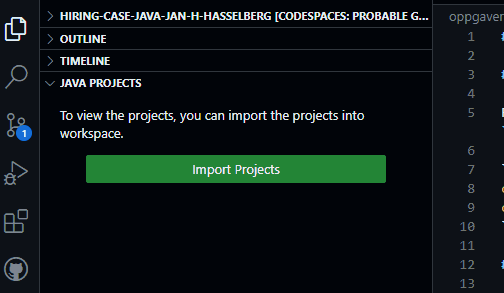
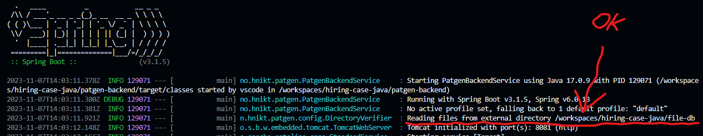

# Backend

## Test og start med kommandolinje-snarveier

For å teste og starte backend-tjenestene kan du bruke kommandoene `cli-run-all-tests` og `cli-docker-compose-app-refresh`.

```sh
cli-run-all-tests # Kjører tester i patgen-backend og zipcode-service.
cli-docker-compose-app-refresh # Bygger og spinner opp Docker instanser av patgen-backend og zipcode-service.
```

## Test og start med *Maven*

Dersom du har satt opp ditt eget utviklingsmiljlø eller foretrekker `mvn` så går det naturligvis an å bruke `mvn` istedenfor.

```sh
cd patgen-backend
mvn test
mvn spring-boot:run -Dspring-boot.run.jvmArguments="-Dpatgen-backend.cors-registration.allowed-origins=\"http://localhost:8080 http://localhost:8082 $PATGENFRONTEND_EXTERNAL_URL $ZIPCODESERVICE_EXTERNAL_URL\"" # CORS innstillinger.
```

```sh
cd zipcode-service
mvn test
mvn spring-boot:run -Dspring-boot.run.jvmArguments="-Dzipcode-service.cors-registration.allowed-origins=\"http://localhost:8080 http://localhost:8081 ${PATGENFRONTEND_EXTERNAL_URL} ${PATGENBACKEND_EXTERNAL_URL}\"" # CORS innstillinger.
```

## Importer Java prosjektene i VSCode

Import-steget analyserer prosjektene det finner og man får mer hjelp fra VSCode.

Gå til filtreet i venstre marg, velg *JAVA PROJECTS*, trykk import..



## Oppgave 1 - Postnummer og adresse

Prosjektet du skal endre finner du i mappen `patgen-backend/`.

Legg til gateadresse (gatenavn med husnummer f.eks. `streetNameAndNumber`) og postnummer (f.eks. `postalCode`) på pasienten i responsen på *API-endepunktet* `/generate-patient`. Postnummeret skal være et gyldig norsk postnummer og gateadressen hentes fra en fil likt fornavn og etternavn. Du trenger ikke å tenke på poststed, det ser vi på senere.

Husk å skriv notater i `oppgave1.md`, forklar hvordan du kom fram til valgt løsning for postnummer.

## Oppgave 2 - Randomiser kjønn og navn

Den opprinnelige koden returnerer for enkelhetsskyld bare mannlige testpasienter. Kvalitetsregister-teamet ønsker å få endret *API-endepunktet* `/generate-patient` slik at denne returnerer vilkårlig kvinne eller mannlige pasienter, med 50/50 sjanse for det ene eller det andre kjønnet. I tillegg ønskes det støtte for å velge om man bare ønsker kvinnelige eller mannlige pasienter.

I tillegg til at *firstname* kan inneholde kvinnelig eller mannlig fornavn, er det også ønskelig å innføre ett nytt felt i svaret fra *API-endepunktet* `/generate-patient`, dvs. "sex". Verdiene i det nye feltet skal bruke [ISO 5218](https://en.wikipedia.org/wiki/ISO/IEC_5218) koder, du kan gjenbruke `SexIso5218.java` for dette. Verdien i feltene *firstname* og *sex* skal passe sammen, slik at pasient får navn som passer til kjønn.

For å hjelpe deg i gang har prosjektet fra før en deaktivert test i `PatientGeneratorTest.java`. Denne kan du bruke som et utgangspunkt for å skrive tester til denne oppgaven.

Kjør testene et visst antall ganger til du er sikker på at de fungerer, gitt at det muligens opererer med tilfeldigheter.

## Oppgave 3 - Bytt til fødselsdato

Skriv om koden slik at pasienten får en tilfeldig fødselsdato fra 0 til 100 år siden.
Alder har ikke lenger behov for sin egen *property*, ettersom alder nå kan regnes ut fra fødselsdato i en *getter*.

```java
// Pseudo-kode; age property er ikke nødvendig i backend men av hensyn
// til bakoverkompabilitet må det fortsatt være tilgjengelig i API'et.
int getAge() { return calculateAgeFromBirthdate(getBirthdate()); }
```

Fødselsdato skal legges til i *respons-objektet*, samtidig skal API være bakoverkompatibelt med eksisterende klienter som leser *age property*.

## Oppgave 4 - Filbasert datakilde

Kvalitetsregister-teamet ønsker å selv kunne sette opp ett testsett av pasientdata det skal velges vilkårlige pasientfelt fra. Oppgaven går i denne omgang ut på å lage ett grensesnitt for endring av etternavn, og det skal benyttes en filbasert datakilde.

Kopier ressursfiler (navne-filer m.m) til `$WORKSPACE_FOLDER/file-db/`. Merk at `$WORKSPACE_FOLDER` er snarvei til roten av det lokale *git repositoriet* i Codespaces, og filbanen vil variere med navn på *repo*.

```sh
mkdir $WORKSPACE_FOLDER/file-db # Oppretter mappen file-db i roten av git repo.
cp $WORKSPACE_FOLDER/patgen-backend/src/main/resources/*.txt $WORKSPACE_FOLDER/file-db
ls $WORKSPACE_FOLDER/file-db # female-first.txt  lastnames.txt  male-first.txt
```

Det er nå flere måter å starte applikasjonen med endret *dirname*:

### Framgangsmåte 1. application.properties

Du kan hardkode *dirname* i `patgen-backend/src/main/resources/application.properties`. Endre _dirname_ slik at den peker på `$WORKSPACE_FOLDER/file-db`. F.eks. kan du bruke miljøvariabel:

```properties
dirname=${WORKSPACE_FOLDER}/file-db
```

Men dette er ikke spesielt fleksibelt siden `$WORKSPACE_FOLDER/file-db` ikke nødvendigvis eksisterer i miljøet der programmet vil kjøre. Så vi bør helst velge en annen metode.

### Framgangsmåte 2. Sende inn som argument i *Maven*

```bash
cd patgen-backend
mvn spring-boot:run -Dspring-boot.run.arguments="--dirname=\"$WORKSPACE_FOLDER/file-db\""
```

Teksten `Reading files from external directory` skal være synlig i Spring-loggen.



Dette var langt bedre, men la oss gjøre det litt lettere for utviklere som skal jobbe videre med tjenesten.

### Framgangsmåte 3. Bruke volumes i docker-compose.yml

Om du ønsker å redigere `docker-compose.yml` direkte kan du gjøre det, men i dette eksempelet overstyrer vi konfigurasjonen fra en annen *docker-compose* fil.

Lag en ny fil `docker-compose.override.yml`.

```sh
touch $WORKSPACE_FOLDER/docker-compose.override.yml
```

Legg til følgende innhold.

```yaml
services:
  patgen-backend:
    volumes:
      - ${WORKSPACE_FOLDER}/file-db:/root/file-db
    environment:
      dirname: "/root/file-db"
```

Se endringene med kommandoen `docker-compose config`. Pass på at du står i *`$WORKSPACE_FOLDER`* mappen der *docker-compose* filene befinner seg. Du vil se at innstillinger i `docker-compose.yml` er overstyrt.

Kjør opp tjenestene og sjekk loggene.

```sh
cli-docker-compose-app-refresh
docker-compose logs -f patgen-backend # ctrl + c kansellerer loggvisningen
```

Om alt går bra vil ``DirectoryVerifier.java`` logge *Reading files from external directory ..*.  Eller *Directory .. does not exist* når det ikke virker.

Implementer følgende nye tjenester der du bruker fil som inneholder **etternavn** som datakilde:

* Legg til nye etternavn pseudo-kode eksempel `add("Åsen")`. Håndter situasjon der etternavnet finnes fra før.
* Fjern etternavn pseudo-kode eksempel `remove("Åsen")`. Håndter situasjon der etternavn _ikke_ finnes fra før.
* Lever en liste over alle pseudo-kode eksempel `listAll()`.

Bruk `SimpleFileStore.java` for å manipulere filene - den originale forfatteren vil implementere ferdig testene og strukturere ting annerledes etter hvert. Logikken skal ligge i kontrolleren inntil videre. Gjør ingen flere endringer i SimpleFileStore enn du behøver for å få det til å virke. For enkelhets skyld er endepunktene påbegynt i `PatientGenerator.java`. Du står fritt til å utvikle API'et for oppdatering av **etternavn** slik du ønsker.

Husk å skriv notater i `oppgave4.md`, utdyp gjerne om eventuelle utfordringer underveis.

## Oppgave 5 - Hente poststed fra REST tjeneste

Denne oppgaven går ut på å legge til stedsnavn på testpasient ved hjelp av */zipcode-details?zipCode={postnummer}* endepunkt på *zipcode-service*. Zipcode-tjenesten er dessverre noe ustabil og man får ikke alltid det svaret man ønsker. Hvordan du starter tjenesten er beskrevet tidligere.

```sh
echo $ZIPCODESERVICE_EXTERNAL_URL/zipcode-details?zipCode=1234 # Skriver ekstern URL til endepunkt.
```

I denne oppgaven kan du hoppe over skriving av tester.

* Legg til ett nytt felt på testpasienten for poststed.
* Bruk tjenesten `zipcode-service` og gjør et REST kall mot */zipcode-details?zipCode={postnummer}* for å hente et poststed.
* `zipcode-service` simulerer feil og ukjente postnummer relativt ofte.
  * Håndter dette slik at kun faktiske poststed populeres i pasientobjektet.
  * Testpasienten skal genereres uten poststed dersom zipcode-tjenesten feiler.
  * Dersom zipcode-tjenesten ikke finner ett stedsnavn, gir du testpasienten ett annet postnummer og forsøker igjen.

---

Når du er ferdig med oppgavene over, se instruksene i [README](../README.md) om leveringsmåte. Har du valgt å jobbe med *backend* oppgavene er det ikke nødvendig å løse *[frontend oppgavene](frontend.md)*. Poenget er å gjøre en av delene. :)